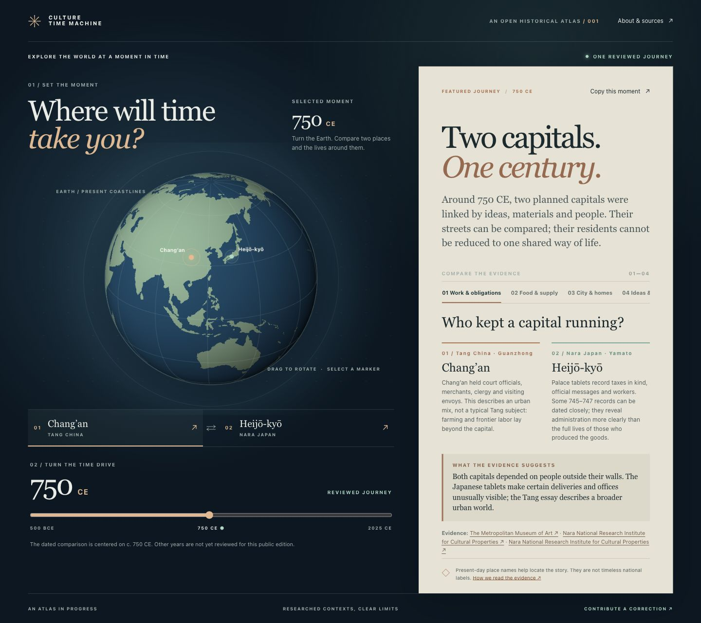
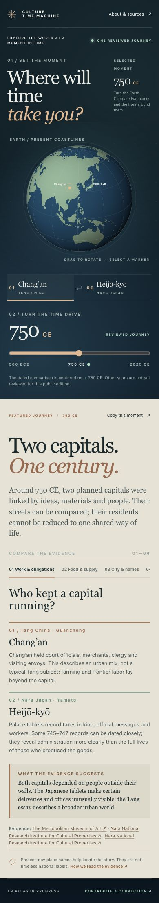

# Culture Time Machine · public web edition

Choose a moment in history, explore places, and compare what the evidence says about everyday life. This small public edition opens with one researched comparison: **Chang’an and Heijō-kyō around 750 CE**.




**Repository:** https://github.com/zhipanxiong-ux/culture-time-machine-web  
**Live URL:** pending Cloudflare account connection. The local preview is available now.

## Run locally

Requires Node.js 20+ and Python 3. Run from this directory:

```sh
npm ci
npm test
npm run build
npm run dev
```

`.env.example` records the empty local configuration for this release. No secrets are needed.

Wrangler serves the site at `http://127.0.0.1:8787/` and `/api/health`. You can also open `public/index.html` directly in a browser to read the content without a server; the health endpoint only exists through the Worker. `npm run build` copies only nine named public files into `dist/`.

## Architecture

- `public/` is plain HTML, CSS and JavaScript. It uses an orthographic 2D canvas globe drawn from the public-domain Natural Earth 1:110m land polygons. Place buttons provide a no-canvas alternative.
- `public/content.js` contains the reviewed journey, stable IDs, topic claims, sources and scope notes. No content database, AI call, account or public write endpoint is used.
- `public/state.js` handles URL state and BCE/CE display. A shared link stores the year, ordered places and topic in its query string; browser back and forward restore them.
- `src/worker.mjs` serves `/api/health` and JSON 404s for unknown `/api/*`. Cloudflare Static Assets serve the rest.
- `build.py` allowlists the deployable files. The parent native repository, media library, notes and history are excluded.

Read [the content model](docs/content-model.md), [design decision](docs/design-direction.md), [deployment guide](docs/deployment.md), [audit](docs/project-audit.md), [release report](docs/release-report.md) and [attributions](ATTRIBUTION.md).

## Contribute

See [CONTRIBUTING.md](CONTRIBUTING.md). The public site will point to the issue template in the public GitHub repository. Claims are reviewed before publication.

## Licensing

The app code is under the [MIT License](LICENSE). The Natural Earth land data is public domain; see [ATTRIBUTION.md](ATTRIBUTION.md). External research pages remain under their own terms; this repository includes links and original summaries, not copied media.
